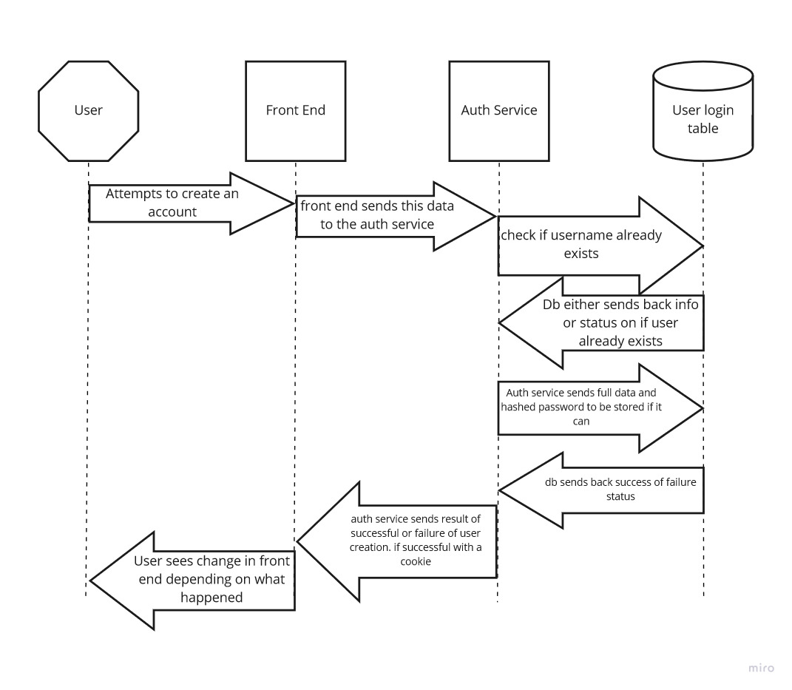
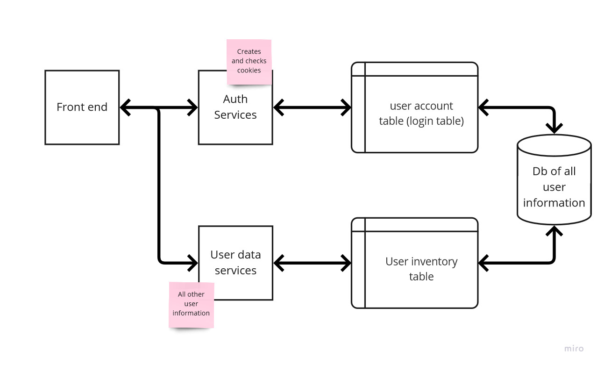

# Unnamed website design documents.
Lead programmer: Alyssa Comstock

UI Design / Concept: Link

## Context and Scope:
We want to create a virtual pet website in a similar vein as Neopets that conceptually brings in a lot of UI design and themes from early 2000s internet.  Users will be able to create free accounts, adopt virtual pets, and play with them. Design-wise the website should resemble early 2000s internet, and should be simple, but cute.

## Goals:
- Allow for user account creation
- Allow for the user to login
- Create a system where the user can view a page once they have logged in like an inventory or user profile with a cookie system

## Design:

### UI Design:
[Paper prototypes pending]

### System Design:
UML of user login and what happens when a user attempts to login:

UML of user new account creation

Diagram of the general architecture:
- Auth services is responsible for creating new user accounts, logging in users, creating cookies, and checking if the user can view a page.
- User data service is responsible for all other user information that is not sensitive.  This can be user inventory, their profile, their virtual pets, and other things that can be shown to the public or logged in users.

## APIs:
Both the auth services and user data services are done in an API manner.  These are done in Node.js.

## Data Storage Method:
We are using MongoDB for all data storage.  The only things that are allowed to do CRUD operations on the DB are the APIs, and the APIs need to be authenticated and authorized with tokens first.  This is especially important in sensitive tables. Passwords must be hashed and salted before stored.

## Database design:

database design in progress

User_Accounts:
-	_id – Primary key, auto generated from mongodb
  - Id that mongodb sets.
-	userId – Int, key, unique, auto-incremented

  Autoincremented user id.
-	username – String, unique not null
  - Account username for the user.  Needs to be unique.
-	displayName – String, not unique, can be null
  - Display name for the user profile, not the same as a username.
-	password – String, hashed and salted password, not null
  - User password for login.
-	email – String, not null
  - User email.
-	verifiedAccount – Boolean, default false
  -	Used when user verifies their account over email.
-	dateCreated – date, not null, autogenerated
  -	auto generated when the user account is created.
-	adminAccount – Boolean, default false
  -	Used for authorization for admins only.
-	modAccount – Boolean, default false
  -	Used for mod accounts only.

User_Information:
-	_id – primary key, auto generated from mongodb
-	userId – int, foreign key, not null
-	username – String, unique, not null
-	inventory – array of item foreign keys that are item ids
-	Pets – array of pets, for now just pet names

## Need to research:
- Security measures
- Cookies for user login so that they can only view pages when logged in.
