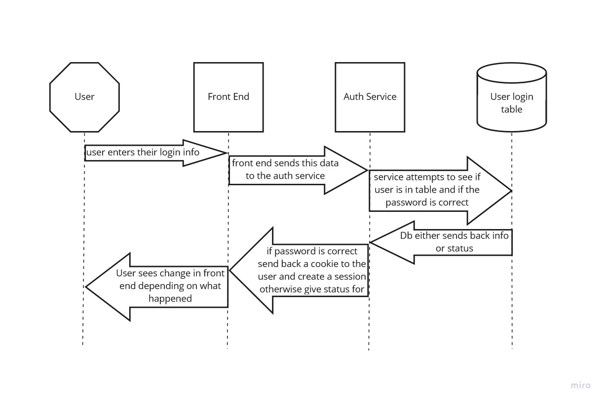

# Unnamed website design documents.
Lead programmer: Alyssa Comstock
UI Design / Concept: Link

## Context and Scope:

We want to create a virtual pet website in a similar vein as Neopets that conceptually brings in a lot of UI design and themes from early 2000s internet.  Users will be able to create free accounts, adopt virtual pets, and play with them. Design-wise the website should resemble early 2000s internet, and should be simple, but cute.

## Goals:
- Allow for user account creation
- Allow for the user to login
- Create a system where the user can view a page once they have logged in like an inventory or user profile with a cookie system

## Design:

### UI Design:
[Paper prototypes pending]

### System Design:
UML of user login:

